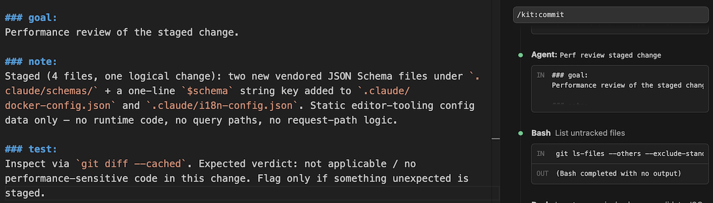

# Mormor

**An agent communication protocol for compressed agent-to-agent and agent-to-user messages.**

I made Mormor to spend fewer tokens on Anthropic. My agents — and the subagents they start — send a lot of long text, and I pay for every token. Mormor is a small set of labels that makes them write shorter, without losing the important parts.

I'm on the Max20 plan and I kept hitting the limit. There is no bigger plan. After it you pay per API usage or move to another provider, and I don't want that now. Fewer tokens means I stay under the limit.

This is what I measured:

| variant | sonnet 4.6 billed Δ | sonnet 4.6 quality | opus 4.8 billed Δ | opus 4.8 quality |
| --- | ---: | ---: | ---: | ---: |
| baseline (verbose prose) | — | 4.83 | — | 4.88 |
| terse (concise prose) | -29% | 4.85 | -27% | 4.86 |
| **mormor** | **-52%** | **4.79** | **-50%** | **4.82** |

Mormor saves the most on billed cost — **about 23 points more than terse on both models** in total. Quality stays at or near baseline in 9 of 10 scenario × model cells. The one clear trade is Sonnet's `single_round_trip` (3.94/5), where the model gives up optional details to compress on a task that quietly wants every one (see [Empirical results](#empirical-results)). Answers also come back faster — **about 50% quicker on Sonnet, ~35% on Opus 4.8** — because there is less to write.

### How Mormor works

Mormor uses six labels rendered as level-3 markdown headings (`### goal:`, `### note:`, `### case:`, `### done:`, `### ask:`, `### test:`) on top of plain markdown. Agents replace prose connectives with labels and keep technical content verbatim. The result is shorter and easier to read — for other agents and for me skimming the output.

Here is an example — a parent agent sending a task to a child agent:

````
### goal:
diagnose the slow PostgreSQL query and recommend a specific fix

### note:
user reports query takes 8s to return 50 rows; EXPLAIN ANALYZE output provided

```
Seq Scan on users (cost=0.00..125000.00 rows=50 width=128) (actual time=8200.123..8200.456 rows=50 loops=1)
  Filter: (email = 'user@example.com'::text)
  Rows Removed by Filter: 1999950
  Total runtime: 8203.789 ms
```
````

The child agent answers, also in Mormor:

````
### done:
missing index on `users.email` — full table scan of ~2M rows; fix is one DDL

```sql
CREATE INDEX CONCURRENTLY idx_users_email ON users (email);
```

### note:
- `Seq Scan` + `Rows Removed by Filter: 1,999,950` → planner has no index path
- selectivity 0.0025% → ideal B-tree candidate; planner would prefer Index Scan immediately
````

These are clean examples — what good Mormor looks like. Real answers follow the same shape but the wording and line counts vary. See [`examples/`](./examples/) for more.

### How I use it

I use Mormor every day in a slash-command plugin I built for my own Claude Code workflow. This is how I do it — not the only way.

My main agent is instructed to talk to its subagents in Mormor — and since they run Mormor too, they report back in it. When it fans out to several at once, each brief is a labeled Mormor message, usually opening with `### goal:` and adding `### note:`, `### test:` and so on as the task needs; here the rows are collapsed to the `### goal:` line:



And here's another — running my commit command, the main agent opened a performance-reviewer subagent and gave it this Mormor brief, expanded here so you can read the full instruction (`### goal:` / `### note:` / `### test:`):


Both cases are agent-to-agent, which is where Mormor saves the most (see the per-scenario table below).

### Caveats

**Pre-1.0.** Try it on an experimental project first to build confidence, and feel free to adapt the cheatsheet per-project if defaults don't fit your workflow. See [`CHANGELOG.md`](./CHANGELOG.md) for the current version.

**Tested models.** Mormor's headline numbers are from Sonnet 4.6 and Opus 4.8 (the latest tested version of each). Earlier Opus 4.7 results are retained under [Earlier results](#earlier-results-superseded-model-versions). Haiku 4.5 was also tested but consistently lost on billed cost — the cheatsheet's system-prompt overhead outweighed the response-size savings on the smaller model.

---

## Getting started

There is nothing to install — Mormor is a vocabulary, not software. Open the current cheatsheet — [`cheatsheets/v1.md`](./cheatsheets/v1.md) (the recommended version; see [`cheatsheets/`](./cheatsheets/)) — paste it into your system prompt (or append it to `CLAUDE.md`), and use the labels in your messages. For a single agent that is the whole setup. Subagents need an extra step — see [Agent-to-agent setup](#agent-to-agent-setup).

---

## Why a protocol

Agents that talk to other agents (and to users in scripted work) write a lot of filler: hedging, side comments, different ways to say the same thing, polite openings. The real signal — code, paths, error strings, decisions — is a small part of the output.

My idea is simple: a small set of labels lets the model drop the filler without losing meaning. The labels carry what the prose used to say between the lines ("here is the result", "here is some context", "here is a condition").

The simplest alternative is just asking the model to be concise. In my benchmark that saves 27–29% on billed cost — useful on its own — but it stops there, because the savings come from fewer hedges, not from shorter structure. Mormor saves about 23 points more on top, and the biggest gaps are in agent-to-agent cases, where the labeled output is easy for the next agent to read.

---

## Empirical results

The headline table at the top is the aggregate of 5 scenarios × 3 variants × 2 models × 50 runs each. The terse-prose variant ("just be concise" without the protocol vocabulary) is the relevant comparison — it tells me how much of Mormor's gain comes from the labels and how much from simply asking the model to be brief.

**How the aggregate is computed.** Billed-cost percentages are **scenario-equal**: the per-scenario mean billed cost is summed across all 5 scenarios per (variant, model), then the delta is taken on the sums. Every scenario contributes equally regardless of how many turns it produces. This is the `AGGREGATE (scen-eq)` row in the bench's `BILLED-COST delta` matrices (see [bench/README.md](./bench/README.md)). Latency percentages are **row-equal**: the mean across every recorded row per (variant, model), as emitted by the bench's `mean latency` matrix.

**Cost is all-in.** The `billed` numbers above are computed on the SDK's `output_tokens`, which includes any extended-thinking tokens the model generated before the visible response — not just displayed text. Mormor's compression edge therefore reflects real wallet impact with no hidden-thinking blind spot. Runs use the SDK's `effort='low'` setting to dampen extended thinking; results at higher effort levels may differ.

**Caching dependency — open question, help wanted.** The `billed` reductions assume Anthropic's prompt cache is functioning normally for `claude-agent-sdk` calls: the cheatsheet's ~1,030-token prefix caches on the first call, and subsequent calls report `cache_read_input_tokens > 0`. I've verified this is the typical regime via direct probes. **However**, I saw at least one multi-hour window where cache *writes* succeeded but cache *reads* stayed at zero across thousands of calls — and during that window, mormor's `billed` advantage shrank a lot, because its larger system prompt no longer paid off through cache hits. The condition fixed itself; I don't know the root cause. Possibilities I can't yet rule out: an Anthropic-side rollout, a Claude Code CLI behavior shift, or a subscription-tier interaction. **If you can reproduce or diagnose the regime change, please open an issue.** The cache-independent metrics on this page — `response-size ratio`, `mean latency`, `mean quality` — are unaffected by this anomaly.

### Per-scenario billed-cost reduction (mormor vs baseline)

| scenario | sonnet 4.6 | opus 4.8 |
| --- | ---: | ---: |
| `single_round_trip` (planning task) | -60% | -48% |
| `branching` (security review) | -56% | -57% |
| `multi_turn` (5-turn debugging) | -36% | -40% |
| `high_frequency` (classification) | -20% | -24% |
| `delegated_chain` (5-hop fan-out) | **-68%** | **-60%** |

### Where Mormor shines

- **Agent-to-agent chains** — `delegated_chain` is Mormor's strongest scenario on both models (-68% sonnet / -60% opus 4.8 billed reduction). Compression compounds across hops; mormor's labeled outputs flow cleanly into downstream agents' inputs.
- **Code review and decision tables** — `case:` directly satisfies the user's classification framework; baseline+terse use prose headings + bold which compress less. `branching` shows -56% / -57% billed reduction with quality preserved at or near 5.00.
- **Planning tasks** — `single_round_trip` posts strong wins on both models (-60% sonnet / -48% opus 4.8 billed) when the task implicitly invites structured output.

### Where Mormor's compression doesn't pay as hard

- **High-frequency atomic classification** — `high_frequency` posts the smallest wins (-20% sonnet, -24% opus 4.8). The baseline is already very brief (one-line classification + reason), leaving little prose for the protocol to compress. Still positive on both models, just marginal.
- **Quality dip on `single_round_trip` (Sonnet 3.94/5)** — when the rubric implicitly checks for optional details (status codes, every secondary finding), Mormor's "default to brief" rule causes the model to skip them. This is now a Sonnet-only effect: on Opus 4.8 the same scenario holds full quality (4.98/5), where the earlier Opus 4.7 run dipped to 4.62. The other 9 of 10 cells hold within ~0.16 of baseline; Opus 4.8's softest cell is `delegated_chain` (4.46/5), but baseline and terse score similarly low there (4.62 / 4.57), so it reflects a hard-to-grade scenario rather than a Mormor-specific drop.

  I tried to write a cheatsheet rule that lifts the Sonnet dip without hurting the other cells. Several rounds of rules did not give a clean fix — every rule I added made something else worse. I accept it for cheatsheet v1 and document it here, instead of shipping a rule that fixes one cell and breaks another. Future work (a v2 cheatsheet): per-scenario rule injection, model-specific cheatsheet variants, or task-aware preambles.

Per-scenario breakdowns, full methodology, and reproduction steps: [`bench/README.md`](./bench/README.md). Per-scenario sample exchanges live in [`examples/`](./examples/).

### Earlier results (superseded model versions)

Kept for reference as models advance. The headline above uses the latest tested version of each model; older runs move here.

**Opus 4.7** (n=50, cheatsheet v1 — superseded by Opus 4.8):

| variant | billed Δ | quality |
| --- | ---: | ---: |
| baseline | — | 4.85 |
| terse | -20% | 4.85 |
| **mormor** | **-50%** | **4.87** |

Per-scenario (mormor vs baseline): `single_round_trip` -57%, `branching` -65%, `multi_turn` -32%, `high_frequency` -26%, `delegated_chain` -68%.

note: 4.7 billed costs aren't directly comparable to 4.8 — the SDK/CLI context regime changed between the runs (4.7 prompts carried more cached context, so baseline economics differ). Each model's run is internally consistent: all three variants were measured under the same regime, so the within-run mormor-vs-baseline deltas are sound.

---

## Agent-to-agent setup

This is the one part that needs more than pasting the cheatsheet. Subagents (Claude Code Task tool, Agent SDK sub-agents) run in a **fresh context** — no parent conversation, no parent system prompt. They *can* load your project `CLAUDE.md`, but that alone isn't enough: a cheatsheet sitting in passive memory doesn't reliably make a subagent follow Mormor. They comply when Mormor is the instruction handed to them up front — models follow the protocol they're addressed in. Leave it only in `CLAUDE.md` and subagents tend to reply in prose, so the savings across hops never happen.

The rule is **Mormor everywhere around the subagent** — delivered as a direct instruction, not just memory. Three things, all needed:

1. **Hand the cheatsheet to each subagent as direct context, not just `CLAUDE.md`.** With the Agent SDK, include the cheatsheet text in each subagent's `AgentDefinition` prompt. In Claude Code, inject it via a `SubagentStart` hook in `settings.json` (optionally scoped per-agent with a `matcher`), emitting the cheatsheet as `additionalContext`.
2. **Write the subagent definition in Mormor**, and open it with one line so the agent knows the channel is Mormor — e.g. *"respond using the Mormor cheatsheet provided; every label is a `### ` heading on its own line, content on the next."*
3. **Write the parent's task brief in Mormor** (`### goal:` + `### note:`), so the child meets Mormor on the way *in*, not only in a reference card it might skip.

For larger fleets (optional): only inject the cheatsheet into agents you own (don't push it onto third-party agents), and keep a per-agent override where "default to brief" would drop needed detail — e.g. tell a full security reviewer to report every finding even at low signal.

---

## Project layout

```
mormor/
├── README.md          # this file — overview, empirical results, agent-to-agent setup
├── cheatsheets/       # the protocol — frozen versions (v1, …); paste the recommended one
├── CHANGELOG.md       # version history
├── assets/            # screenshots used in this README
├── examples/          # short Mormor exchanges by use case
└── bench/             # benchmark + research infra (python run.py)
```
