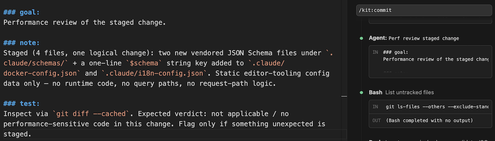

# Mormor

**An agent communication protocol for compressed agent-to-agent and agent-to-user messages.**

I made Mormor to spend fewer tokens on Anthropic. My agents — and the subagents they start — send a lot of long text, and I pay for every token. Mormor is a small set of labels that makes them write shorter, without losing the important parts.

I'm on the Max20 plan and I kept hitting the limit. There is no bigger plan. After it you pay per API usage or move to another provider, and I don't want that now. Fewer tokens means I stay under the limit.

This is what I measured:

| | baseline | terse | mormor |
| --- | ---: | ---: | ---: |
| **Fable 5.1** — billed Δ | — | -31% | **-46%** |
| **Fable 5.1** — quality | 4.90 | 4.97 | 4.97 |
| **Opus 5.5** — billed Δ | — | -21% | **-36%** |
| **Opus 5.5** — quality | 4.97 | 4.97 | 4.98 |
| **Sonnet 5** — billed Δ | — | -28% | **-30%** |
| **Sonnet 5** — quality | 4.98 | 4.98 | 4.97 |

<sub>Billed Δ is vs the **baseline** (verbose-prose) variant; **terse** = "just be concise", **mormor** = the v5 cheatsheet. Quality is 1–5. Billed Δ is measured on the current Claude Code CLI, where the short baseline prompt caches too, so it understates the compression; on the cache-independent response size, mormor answers are **0.48× baseline** on Fable 5.1, **0.54×** on Opus 5.5, and **0.60×** on Sonnet 5 (see [Empirical results](#empirical-results)).</sub>

Mormor saves the most on billed cost while holding quality at or near baseline on every model. Answers also come back faster — **about 41% quicker on Fable 5.1, ~37% on Opus 5.5, ~24% on Sonnet 5** — because there is less to write.

The cheatsheet caches on all three models — it clears Anthropic's 1,024-token cache minimum, so the prefix bills at the cached rate. Nearly every scenario is a billed win; the exceptions are covered under [Empirical results](#empirical-results).

### How Mormor works

Mormor uses six labels rendered as level-3 markdown headings (`### goal:`, `### note:`, `### case:`, `### done:`, `### ask:`, `### test:`) on top of plain markdown. Agents replace prose connectives with labels and keep technical content verbatim. The result is shorter and easier to read — for other agents and for me skimming the output.

Here is an example — a parent agent sending a task to a child agent:

````
### goal:
diagnose the slow PostgreSQL query and recommend a specific fix

### note:
user reports query takes 8s to return 50 rows; EXPLAIN ANALYZE output provided

```
Seq Scan on users (cost=0.00..125000.00 rows=50 width=128) (actual time=8200.123..8200.456 rows=50 loops=1)
  Filter: (email = 'user@example.com'::text)
  Rows Removed by Filter: 1999950
  Total runtime: 8203.789 ms
```
````

The child agent answers, also in Mormor:

````
### done:
missing index on `users.email` — full table scan of ~2M rows; fix is one DDL

```sql
CREATE INDEX CONCURRENTLY idx_users_email ON users (email);
```

### note:
- `Seq Scan` + `Rows Removed by Filter: 1,999,950` → planner has no index path
- selectivity 0.0025% → ideal B-tree candidate; planner would prefer Index Scan immediately
````

These are clean examples — what good Mormor looks like. Real answers follow the same shape but the wording and line counts vary. See [`examples/`](./examples/) for more.

### How I use it

I use Mormor every day in a slash-command plugin I built for my own Claude Code workflow. This is how I do it — not the only way.

My main agent is instructed to talk to its subagents in Mormor — and since they run Mormor too, they report back in it. When it fans out to several at once, each brief is a labeled Mormor message, usually opening with `### goal:` and adding `### note:`, `### test:` and so on as the task needs; here the rows are collapsed to the `### goal:` line:



And here's another — running my commit command, the main agent opened a performance-reviewer subagent and gave it this Mormor brief, expanded here so you can read the full instruction (`### goal:` / `### note:` / `### test:`):


Both cases are agent-to-agent, which is where Mormor saves the most (see the per-scenario table below).

### Caveats

**Pre-1.0.** Try it on an experimental project first to build confidence, and feel free to adapt the cheatsheet per-project if defaults don't fit your workflow. See [`CHANGELOG.md`](./CHANGELOG.md) for the current version.

**Tested models.** Mormor's headline numbers are from Sonnet 5, Opus 5.5, and Fable 5.1 (the latest tested version of each), all on all 5 scenarios. Earlier Fable 5, Opus 5, Opus 4.8, Opus 4.7, and Sonnet 4.6 results are retained under [Earlier results](#earlier-results-superseded-model-versions). Haiku 4.5 was tested early on but consistently lost on billed cost on the smaller model, so it's not part of the tested set going forward.

---

## Getting started

There is nothing to install — Mormor is a vocabulary, not software. Open the current cheatsheet — [`cheatsheets/v5.md`](./cheatsheets/v5.md) (the recommended version; see [`cheatsheets/`](./cheatsheets/)) — paste it into your system prompt (or append it to `CLAUDE.md`), and use the labels in your messages. For a single agent that is the whole setup. Subagents need an extra step — see [Agent-to-agent setup](#agent-to-agent-setup).

---

## Why a protocol

Agents that talk to other agents (and to users in scripted work) write a lot of filler: hedging, side comments, different ways to say the same thing, polite openings. The real signal — code, paths, error strings, decisions — is a small part of the output.

My idea is simple: a small set of labels lets the model drop the filler without losing meaning. The labels carry what the prose used to say between the lines ("here is the result", "here is some context", "here is a condition").

The simplest alternative is just asking the model to be concise. In my benchmark that saves 21% (Opus 5.5) to 31% (Fable 5.1) on billed cost — useful on its own — but it stops there, because the savings come from fewer hedges, not from shorter structure. Mormor compresses further still (Fable 5.1 −46%, Opus 5.5 −36%, Sonnet 5 −30%) at about equal quality, and the biggest gaps are in agent-to-agent cases, where the labeled output is easy for the next agent to read.

---

## Empirical results

The headline table at the top aggregates 5 scenarios × 3 variants × 50 runs each, on Sonnet 5, Opus 5.5, and Fable 5.1. The terse-prose variant ("just be concise" without the protocol vocabulary) is the relevant comparison — it tells me how much of Mormor's gain comes from the labels and how much from simply asking the model to be brief.

**How the aggregate is computed.** Billed-cost percentages are **scenario-equal**: the per-scenario mean billed cost is summed across all 5 scenarios per (variant, model), then the delta is taken on the sums. Every scenario contributes equally regardless of how many turns it produces. This is the `AGGREGATE (scen-eq)` row in the bench's `BILLED-COST delta` matrices (see [bench/README.md](./bench/README.md)). Latency percentages are **row-equal**: the mean across every recorded row per (variant, model), as emitted by the bench's `mean latency` matrix.

**Cost is all-in.** The `billed` numbers above are computed on the SDK's `output_tokens`, which includes any extended-thinking tokens the model generated before the visible response — not just displayed text. Mormor's compression edge therefore reflects real wallet impact with no hidden-thinking blind spot. Runs use the SDK's `effort='low'` setting to dampen extended thinking; results at higher effort levels may differ.

**Caching note.** Billed savings assume the cheatsheet caches (cached input bills at 0.10×), which needs the prompt prefix to clear Anthropic's [1,024-token minimum](https://platform.claude.com/docs/en/build-with-claude/prompt-caching). The cheatsheet clears it on all three models, so it always caches. Whether the short *baseline* prompt caches depends on the client: on the current CLI it does, which narrows the billed gap without changing the compression. The cache-independent metrics — response-size ratio, latency, quality, compliance — are unaffected, and are the fairer comparison across models.

### Per-scenario billed-cost reduction (mormor v5 vs baseline)

| scenario | fable 5.1 | opus 5.5 | sonnet 5 |
| --- | ---: | ---: | ---: |
| `single_round_trip` (planning task) | -42% | -24% | +4% |
| `branching` (security review) | -36% | -40% | -25% |
| `multi_turn` (5-turn debugging) | -35% | -10% | -28% |
| `high_frequency` (classification) | +25% | +33% | +19% |
| `delegated_chain` (5-hop fan-out) | **-67%** | **-65%** | **-61%** |

The strongest scenario on every model is the agent-to-agent `delegated_chain`, where compression compounds across hops. `high_frequency` is a billed loss on all three: a one-line answer leaves little to compress, so its saving used to come from caching — and once the baseline prompt caches as well, that disappears, even though mormor's answer is still 15–23% shorter. The cache-independent **response-size ratio** tells the cleaner compression story: responses are ~0.48× baseline on Fable 5.1, ~0.54× on Opus 5.5, and ~0.60× on Sonnet 5. Quality stays within 0.05 of baseline in every cell, and above it on Fable 5.1 and Opus 5.5.

**v5 vs v4.** Newer models write tighter prose by default, which shrank v4's lead — on Opus 5.5 its answers were 0.66× baseline, against 0.39× on Opus 5. v5 was tuned for that: most of the extra length came from agent-to-agent briefs that pre-solved the child's task and prescribed a heavy report format, plus conditional caveats and full rewrites where a minimal fix would do. Against the same baselines, v5 takes Opus 5.5 from -25% to **-36%** billed (0.66× → 0.54× response size) and Fable 5.1 from -40% to **-46%** (0.56× → 0.48×), at equal quality. Sonnet 5's earlier -65% was measured in August; Sonnet 5 has since started writing much longer answers under the same prompts, so that figure no longer describes today's model — measured side by side today, v5 answers are ~22% shorter than v4's.

### Where Mormor shines

- **Agent-to-agent chains** — `delegated_chain` is Mormor's strongest scenario (-67% fable 5.1 / -65% opus 5.5 / -61% sonnet 5 billed). Compression compounds across hops; mormor's labeled outputs flow cleanly into downstream agents' inputs.
- **Code review and decision tables** — `case:` directly satisfies a severity→action classification framework; baseline+terse use prose headings + bold which compress less. `branching` posts -40% opus 5.5 / -36% fable 5.1 / -25% sonnet 5 with quality at 5.00.
- **Multi-turn work** — `multi_turn` wins across the board (-35% fable 5.1 / -28% sonnet 5 / -10% opus 5.5).
- **Keeping the model on task** — on Fable 5.1 and Opus 5.5, the prose variants occasionally slip into a degenerate loop on code-investigation prompts, re-emitting the same tool call until the output limit (Fable 5.1: baseline 23 times, terse 4; Opus 5.5: baseline 4 — in 850 calls each). Mormor never did. These runs are excluded from the numbers above.

### Where Mormor's compression doesn't pay as hard

- **High-frequency atomic classification** — `high_frequency` is a small billed loss on all three models (+19% to +33%): a one-line answer leaves almost nothing to compress, so its saving came from caching rather than a shorter response, and on the current CLI the baseline prompt caches too. Mormor's answers are still 15–23% shorter. Fine to use — the payoff is just gone on billed cost.
- **Planning tasks** — `single_round_trip` is the weakest billed cell on Opus 5.5 (-24%) and about even on Sonnet 5 (+4%). The implied-coverage rule spends tokens to keep dimensions the prompt only implies (status codes, payload shapes), and on Sonnet 5 v5 also prompts some extended thinking before planning answers, which uses up the shorter answer's saving. Quality stays at 5.00 on all three.

Per-scenario breakdowns, full methodology, and reproduction steps: [`bench/README.md`](./bench/README.md). Per-scenario sample exchanges live in [`examples/`](./examples/).

### Earlier results (superseded model versions)

Kept for reference as models advance. The headline above uses the latest tested version of each model; older runs move here — including Sonnet 5's August run, from before the model's behaviour changed.

**Sonnet 5, August 2026** (n=50, cheatsheet v4 — superseded: Sonnet 5 has since changed behaviour, re-measured above):

| variant | billed Δ | quality |
| --- | ---: | ---: |
| baseline | — | 4.98 |
| terse | -30% | 4.96 |
| **mormor** | **-65%** | **4.92** |

Per-scenario (mormor vs baseline): `single_round_trip` -64%, `branching` -75%, `multi_turn` -60%, `high_frequency` -41%, `delegated_chain` -67%.

**Opus 5** (n=50, cheatsheet v4 — superseded by Opus 5.5):

| variant | billed Δ | quality |
| --- | ---: | ---: |
| baseline | — | 4.98 |
| terse | -30% | 4.98 |
| **mormor** | **-61%** | **4.99** |

Per-scenario (mormor vs baseline): `single_round_trip` -44%, `branching` -74%, `multi_turn` -53%, `high_frequency` -38%, `delegated_chain` -74%.

**Fable 5** (n=50, cheatsheet v4, 4 scenarios — superseded by Fable 5.1; it declined the `delegated_chain` security-review chain under its usage policy):

| variant | billed Δ | quality |
| --- | ---: | ---: |
| baseline | — | 5.00 |
| terse | -33% | 4.94 |
| **mormor** | **-46%** | **4.98** |

Per-scenario (mormor vs baseline): `single_round_trip` -34%, `branching` -45%, `multi_turn` -54%, `high_frequency` -38%.

**Sonnet 4.6** (n=50, cheatsheet v3 — superseded by Sonnet 5):

| variant | billed Δ | quality |
| --- | ---: | ---: |
| baseline | — | 4.93 |
| terse | -44% | 4.90 |
| **mormor** | **-64%** | **4.90** |

Per-scenario (mormor vs baseline): `single_round_trip` -66%, `branching` -64%, `multi_turn` -55%, `high_frequency` -34%, `delegated_chain` -71%.

**Opus 4.8** (n=50, cheatsheet v3 — superseded by Opus 5):

| variant | billed Δ | quality |
| --- | ---: | ---: |
| baseline | — | 4.95 |
| terse | -24% | 4.94 |
| **mormor** | **-53%** | **4.86** |

Per-scenario (mormor vs baseline): `single_round_trip` -55%, `branching` -51%, `multi_turn` -49%, `high_frequency` -35%, `delegated_chain` -58%.

**Opus 4.7** (n=50, cheatsheet v1 — superseded by Opus 4.8):

| variant | billed Δ | quality |
| --- | ---: | ---: |
| baseline | — | 4.85 |
| terse | -20% | 4.85 |
| **mormor** | **-50%** | **4.87** |

Per-scenario (mormor vs baseline): `single_round_trip` -57%, `branching` -65%, `multi_turn` -32%, `high_frequency` -26%, `delegated_chain` -68%.

note: 4.7 billed costs aren't directly comparable to 4.8 — the SDK/CLI context regime changed between the runs (4.7 prompts carried more cached context, so baseline economics differ). Each model's run is internally consistent: all three variants were measured under the same regime, so the within-run mormor-vs-baseline deltas are sound.

---

## Agent-to-agent setup

This is the one part that needs more than pasting the cheatsheet. Subagents (Claude Code Task tool, Agent SDK sub-agents) run in a **fresh context** — no parent conversation, no parent system prompt. They *can* load your project `CLAUDE.md`, but that alone isn't enough: a cheatsheet sitting in passive memory doesn't reliably make a subagent follow Mormor. They comply when Mormor is the instruction handed to them up front — models follow the protocol they're addressed in. Leave it only in `CLAUDE.md` and subagents tend to reply in prose, so the savings across hops never happen.

The rule is **Mormor everywhere around the subagent** — delivered as a direct instruction, not just memory. Three things, all needed:

1. **Hand the cheatsheet to each subagent as direct context, not just `CLAUDE.md`.** With the Agent SDK, include the cheatsheet text in each subagent's `AgentDefinition` prompt. In Claude Code, inject it via a `SubagentStart` hook in `settings.json` (optionally scoped per-agent with a `matcher`), emitting the cheatsheet as `additionalContext`.
2. **Write the subagent definition in Mormor**, and open it with one line so the agent knows the channel is Mormor — e.g. *"respond using the Mormor cheatsheet provided; every label is a `### ` heading on its own line, content on the next."*
3. **Write the parent's task brief in Mormor** (`### goal:` + `### note:`), so the child meets Mormor on the way *in*, not only in a reference card it might skip.

For larger fleets (optional): only inject the cheatsheet into agents you own (don't push it onto third-party agents), and keep a per-agent override where "default to brief" would drop needed detail — e.g. tell a full security reviewer to report every finding even at low signal.

---

## Project layout

```
mormor/
├── README.md          # this file — overview, empirical results, agent-to-agent setup
├── cheatsheets/       # the protocol — frozen versions; paste the recommended one (see DEFAULT)
├── CHANGELOG.md       # version history
├── assets/            # screenshots used in this README
├── examples/          # short Mormor exchanges by use case
└── bench/             # benchmark + research infra (python run.py)
```
